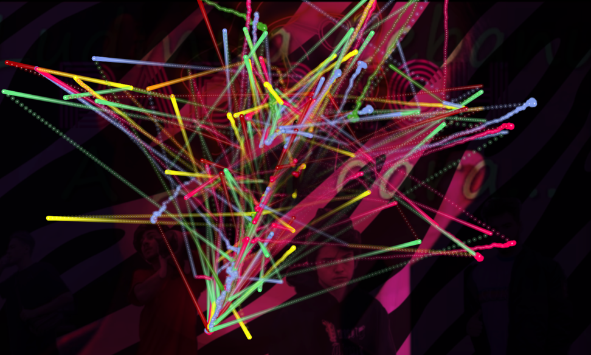

# Vec Tor Bel
At [False Flag](https://false-flag.org/) Nov 10 - Dec 20 2018.

This is an API art piece by [NonCoreProjector](https://noncoreprojector.com/). The sequel to [Verbolect](http://verbolect.com/) ([source](https://github.com/ejarzo/verbolect)).



*False Flag is proud to present Vec Tor Bel from NonCoreProjector—a collective formed by
Rollo Carpenter, Jack Colton, Elias Jarzombek, and John O’Connor.*

*Projected onto the gallery’s main wall is a continually-evolving series of translucent videos,
overlaid with dynamic colored graphs. The visual content is produced by Cleverbot, a chatbot
developed by Rollo Carpenter, driven by an artificial intelligence algorithm. Each day initiates a new
conversation: Cleverbot pulls a headline from the morning’s news, searches that phrase on
YouTube, plays the resulting video, and reads aloud the first comment - which becomes the initial
node on a projected graph. Cleverbot responds to this initial comment, then uses the response for a
subsequent search, repeating this cycle through the end of the day.*

[Read the full press release](misc/Press_Release_NonCoreProjector_Vec-Tor-Bel.pdf)

## Development
You will need the API keys defined in `.env.local.sample`. Make a `.env.local` file with the correct keys.
```
yarn install; yarn start;
```
